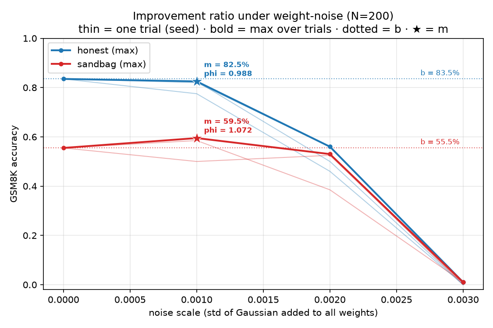

# Noise Injection for Sandbagging Detection

**[Noise Injection Reveals Hidden Capabilities of Sandbagging Language Models](https://arxiv.org/abs/2412.01784)** (Tice et al., NeurIPS 2025).

I really liked this paper and wanted to experiment to improve my understanding. Noise injection as a detection technique is a great practical tool! Because it's an untargeted technique, as the authors point out, it can address cases where sandbagging is a product of complex training dynamics rather than simple, fine-tuned mechanisms.

**Short version of what I found with my current reproduction:** the effect points in the direction the paper predicts, but my noise grid is rough for that to count as evidence. The interesting part turned out to be understanding why it is like that, which in retrospective I could have predicted better (tldr: more noise draws are needed).

---

## The claim being tested

The paper finds that moise injection is an effective detection method for sandbagging, and it rests on the below:

- adding random noise to a model's weights can only make an honest model degrade as noise increases
- a sandbagging model is doing two things at once: solving the problem, and suppressing the answer. Noise may disrupt the suppression while leaving enough of the underlying capability intact, so performance can increase before it eventually collapses. A rise above a model's own clean baseline is the anomaly. 

## Setup

I used `meta-llama/Llama-3.1-8B-Instruct`, which works well with my sole GPU.

| | |
|---|---|
| Model | `meta-llama/Llama-3.1-8B-Instruct` (bfloat16) |
| Sandbagging method | Prompted sandbagging|
| Dataset | GSM8K (`openai/gsm8k') |
| Questions | First 200 (not a random sample, known limitation) |
| Noise | Gaussian, mean 0, added element-wise to all parameters just like the paper |
| Noise scales (σ) | 0.001, 0.002, 0.003, plus a σ=0 baseline |
| Seeds | 3 per non-zero σ |

 2 prompts × (1 baseline + 3 σ × 3 seeds) = 20 evaluation runs, 4,000 generations. My assumption going in was that this grid was the smallest thing that could plausibly surface the effect while still fitting into a sensible amount of GPU time.

## Some implementation decisions to point out

Noise is drawn in float32 and cast down.
Sampling directly in bfloat16 would quantize away much of the perturbation, so I draw and scale in float32 first. This is a known limitation, the addition still round.


Batched generation with left padding.
Generation is batched because 4,000 sequential generations is of course very slow, as expected. 

Load the model once, snapshot the clean weights to CPU once, mutate in place. 
Important to keep all 20 runs to a single model load, and every cell starts from identical clean weights.

Clean split.
`experiments/core_claim.py` needs a GPU and generates. `experiments/core_claim_report.py` only reads CSVs, so every analysis decision is free.

## The criterion

The paper's metric is the improvement ratio:

```
phi = m / b
```

where `b` is accuracy with no noise, and `m` is the maximum accuracy reached by any noised model. One trial is one noise seed swept across every σ, and the reported φ is the maximum across trials.

The hypothesis in the paper is that *some* noise draw disrupts the sandbagging mechanism. (I initially was asking a different question, I averaged accuracy over seeds to interpret the results and asked whether the mean rose above baseline)

φ is a max over the grid, so the grid size really matters.

## Results



Thin lines are individual trials, the bold line is the maximum across trials at each σ, the dotted line is `b`, and the star marks `m`.

| prompt | b | m | best σ | **phi** | paper (llama-3-8b, GSM8k) |
|---|---|---|---|---|---|
| honest | 83.5% | 82.5% | 0.001 | **0.988** | 1.143 |
| sandbag | 55.5% | 59.5% | 0.001 | **1.072** | 1.797 |


My grid was too small to produce a meaningful maximum (the paper reports that a single trial succeeds only 58% of the time on GSM8K which is the lowest rate of any benchmark they tested)

## Running it

```bash
uv sync
huggingface-cli login   # Llama 3.1 is a gated repo
```

**Generation (needs a GPU):**

```bash
uv run python -m experiments.core_claim \
  --run-name phaseC \
  --n-examples 200 \
  --noise-scales 0.001 0.002 0.003 \
  --seeds 0 1 2
```

## Repo layout

```
experiments/
  core_claim.py          # GPU: load once, snapshot, noise, evaluate, log
  core_claim_report.py   # CPU: phi = m/b, bootstrap CIs, plot, findings.md
src/
  eval_model_on_dataset_batches.py   # batched generation + scoring
  answer_parsing.py                  # chat messages, answer extraction
  prompts.py                         # honest / sandbag system prompts
logs/       # raw per-question CSVs, one file per (prompt, sigma, seed)
results/    # generated plots and findings
```

## Possible next steps

- A dense σ sweep over a fixed low range, with as many seeds as affordably so. 
- Password-locked models.
- The authors suggest coding benchmarks, and I would like to try a harder dataset.
- Why does it work? It seems like a mechanistic question, it seems that the suppression is encoded in something more fragile or more localized than the capability itself so maybe varying which layers get noised would be a way to probe that.

## Reference

Tice, C., Kreer, P. A., Shahani, P. S., Helm-Burger, N., Ryzhenkov, F., Roger, F., Neo, C., Haimes, J., Hofstätter, F., & van der Weij, T. (2025). *Noise Injection Reveals Hidden Capabilities of Sandbagging Language Models.* NeurIPS 2025. [arXiv:2412.01784](https://arxiv.org/abs/2412.01784) · [authors' code](https://github.com/camtice/noise_injection_extended)
